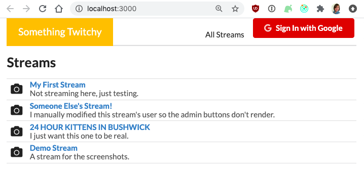
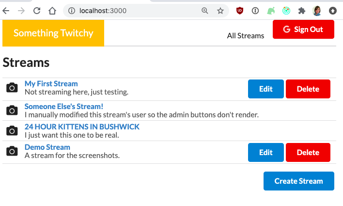
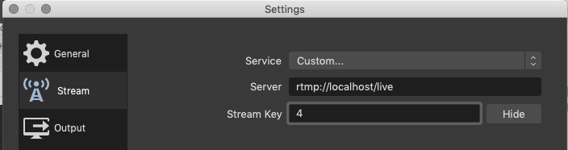
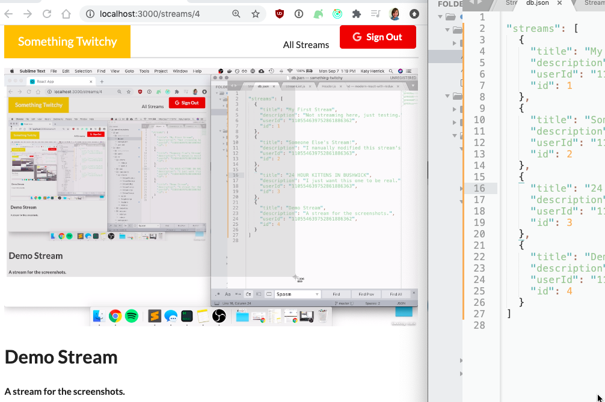

# Something Twitchy

A Twitch-like stream-watching application with a React front-end, a [json-server](https://github.com/typicode/json-server) data store, and a [Node-Media-Server](https://github.com/illuspas/Node-Media-Server) Real Time Messaging Protocol (RTMP) server to connect to a streamer's Open Broadcaster Software (OBS).

## Running Locally
1. Set up OAuth for a new app through the [Google Developer Console](http://console.developers.google.com/). Keep all default configurations, except add `http://localhost:3000` as an Authorized JavaScript origin URI.
1. Insert the created Google clientId into `src/credentials/gapi.js`.
1. In the `/api` directory, install dependencies with
	```bash
	yarn install
	```
1. In the `/client` directory, install dependencies with
	```bash
	yarn install
	```
1. Run the following to ignore changes to the json "database" and changes to personal credentials.
	```bash
	git update-index --assume-unchanged api/db.json
	git update-index --assume-unchanged client/src/credentials/gapi.js
	```
1. In the `/api` directory, run
	```bash
	yarn start
	```
The API server will run at `localhost:3001` .
1. In another tab, navigate to the `/client` directory and run
	```bash
	yarn start
	```
The React client will run at `localhost:3000`.
1. In a third tab, navigate to the `/rtmpserver` directory and run
	```bash
	yarn start
	```
The RTMP server will expose its content to the browser on port 8000, but will accept OBS connections on port 1935.

To stream with OBS, follow the instructions for configuring your stream [here](https://github.com/illuspas/Node-Media-Server#from-obs).

## Screenshots

List of all streams owned by all users, before signing in.


List of all streams after signing in, now with admin buttons.


Example Edit Page. (Very similar to the Create Stream page, but pre-fileld with existing values.)


My local OBS stream settings to broadcast to the location the Watch Stream page is listening on.


Example of a stream visible within the app.


## Routing

### Types of Routers


Explanation of each router from user [Torleif](https://www.udemy.com/user/torleif-berger/) on the Udemy Forums:

**MemoryRouter** uses no visible path. Useful in cases where direct navigation via the address bar doesn't make sense. Consider for example a game. Sure, the game has a start page, maybe some settings, a highscore list, and various stages going through the game. But navigating directly to e.g. /game/level/5 is (probably) not something you want (depending on the game of course).

**HashRouter** has a visible path, but uses the hash thing. Practically for the user this is no different from the BrowserRouter, but using the hash also means you as a developer, when you deploy, can deploy anywhere with no configuration of the web server. It will Just Work™.

**BrowserRouter** also has a visible path, but to properly work, you will need to do special configuration on the web server to make sure that your index.html file is served, even when the web server is asked for something else (like /pagetwo, from the example, which doesn't actually exist on the web server). For example, here's how one could do it using the Apache Web Server using an .htaccess file:
```
RewriteEngine on
RewriteBase /

RewriteCond %{REQUEST_FILENAME} !-f
RewriteCond %{REQUEST_FILENAME} !-d
RewriteRule .* index.html/$0 [L]
```

### Routing Tips

#### Linking to other pages
Use `<Link>` components instead of `<a>` tags. Anchor tags cause a full page load, wiping out all state and variables.

Bad:
```javascript
<a href="/pagetwo">Navigate to Page Two</a>
```

Good:
```javascript
<Link to="/pagetwo">Navigate to Page Two</Link>
```

#### Loading and fetching state
Each component should be designed to work in isolation. When routing between pages, it's not guaranteed that the "index" component responsible for initializing data will be accessed first. Each component must fetch it's own data.

Bad:
```javascript
import { updateData } from '../../actions';

class EditPage extends React.Component { ... }
```

Good:
```javascript
import { fetchData, updateData } from '../../actions';

class EditPage extends React.Component { ... }
```

## Authentication
[TODO]

## Redux DevTools
This project is set up to use the Redux DevTools extension, available for Chrome and Firefox only. Installation instructions are in the [zalmoxisus/redux-devtools-extension](https://github.com/zalmoxisus/redux-devtools-extension#installation) repo.

### Redux DevTools Tips

#### Persisting state across reloads
To keep state and action history across full page refreshes, start a debug session with:
```http://localhost:3000/?debug_session=[some_string]```
At the end of the session, remove the debug_session param to prevent false bugs.