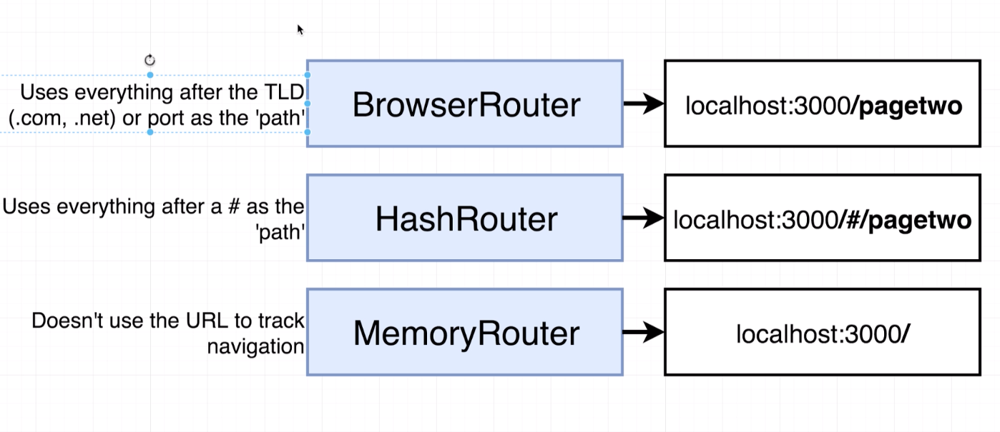

# Something Twitchy

A WIP Twitch-like application.

## Routing

### Types of Routers


Explanation of each router from user [Torleif](https://www.udemy.com/user/torleif-berger/) on the Udemy Forums:

**MemoryRouter** uses no visible path. Useful in cases where direct navigation via the address bar doesn't make sense. Consider for example a game. Sure, the game has a start page, maybe some settings, a highscore list, and various stages going through the game. But navigating directly to e.g. /game/level/5 is (probably) not something you want (depending on the game of course).

**HashRouter** has a visible path, but uses the hash thing. Practically for the user this is no different from the BrowserRouter, but using the hash also means you as a developer, when you deploy, can deploy anywhere with no configuration of the web server. It will Just Work™.

**BrowserRouter** also has a visible path, but to properly work, you will need to do special configuration on the web server to make sure that your index.html file is served, even when the web server is asked for something else (like /pagetwo, from the example, which doesn't actually exist on the web server). For example, here's how one could do it using the Apache Web Server using an .htaccess file:
```
RewriteEngine on
RewriteBase /

RewriteCond %{REQUEST_FILENAME} !-f
RewriteCond %{REQUEST_FILENAME} !-d
RewriteRule .* index.html/$0 [L]
```

### Routing Tips

#### Linking to other pages
Use `<Link>` components instead of `<a>` tags. Anchor tags cause a full page load, wiping out all state and variables.

Bad:
```javascript
<a href="/pagetwo">Navigate to Page Two</a>
```

Good:
```javascript
<Link to="/pagetwo">Navigate to Page Two</Link>
```